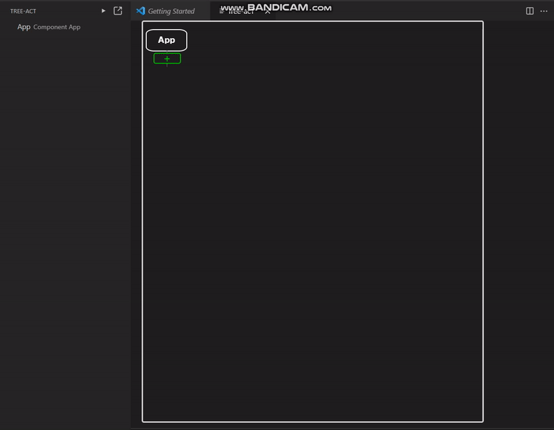

## Insert node

Click '+' button to insert child node.

## Remove node

Click the '-' button above the node to remove. The descendants of removed node will be attached to parent's.

## Collapse node

Click the node to collapse/expand descendants.

## Change name

You can activate name input by double click. To disable, click anywhere except the node.
