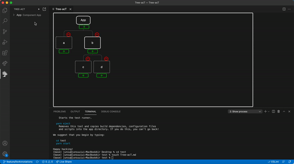

1. When you finish making the tree, click the "Generate React project from Tree" button which is located at the top of the left TREE-ACT panel.
2. Set the installation directory path where you will install the project.
3. Set your project name. You can write a name through the input box shown at the top. After that, press ENTER to confirm your input or ESC to cancel.
4. React project generation finished!!!
