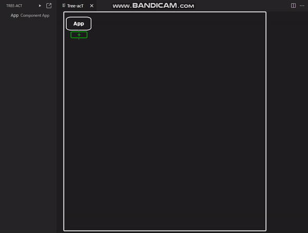
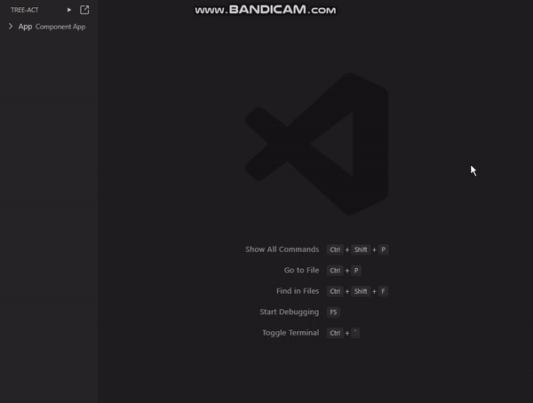

## Close Tree-acT panel

If you close "Tree-acT" while working, you can still reopen the existing task by pressing the "Open Tree-acT Panel" button. Please refer to the below for detailed explanation.

## Reopen Tree-acT panel

As shown in the gif file above, you can reopen an existing job by pressing the "Open Tree-acT Panel" button() on the top right of the left TREE-ACT panel.
